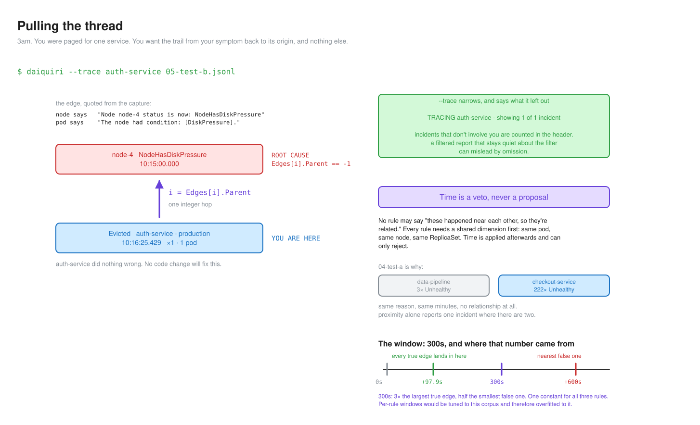
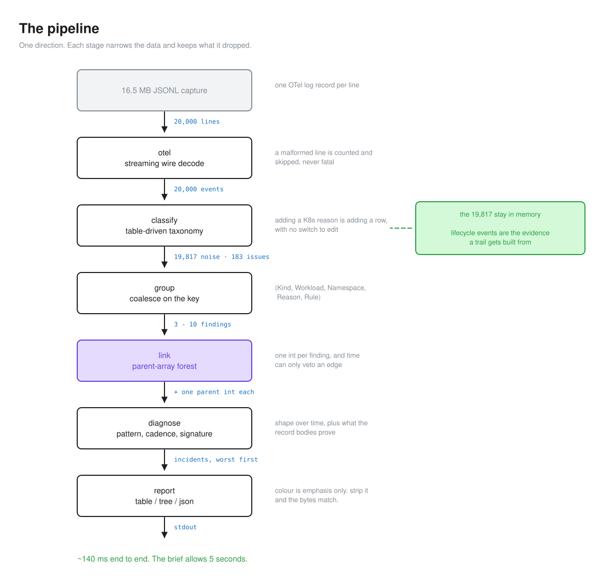
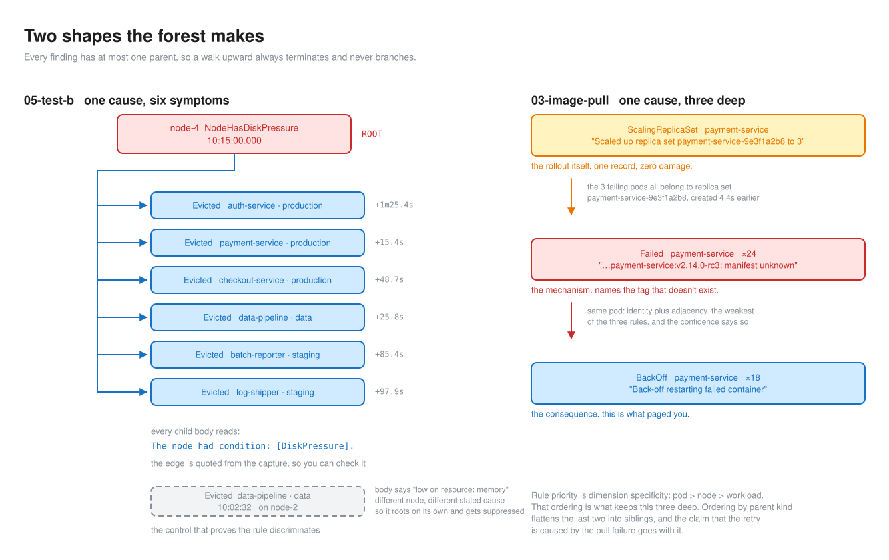
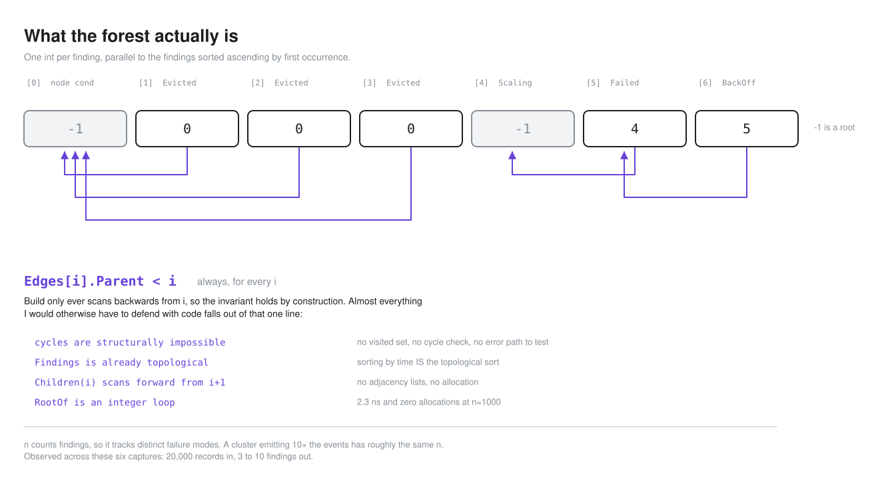

# Design decisions

The brief wants a tool and on-call reasoning. Here's the reasoning behind the
tool.

Every decision below has a longer entry in [`docs/decisions.md`](docs/decisions.md)
with the alternatives and the fixture evidence. 59 entries, reversals left in.
This is the readable version.

## North star

My end user is the team. The person holding the pager at 3am, and the four
people they'd otherwise have to wake up. A dashboard nobody is looking at does
not help either of them.

So I optimised for what that team can do with the output. Five things:

**Know what broke, in one screen.** The verdict is the first thing on the page
and you can stop there. Root cause, what actually broke, what it means for
whoever owns the service, and the cluster's own words underneath.

**Follow the trail from your symptom to its origin, through namespaces you don't
own.** You get paged for `auth-service`. One command walks you back to a node in
someone else's namespace that filled its disk.

**Stop paging on background noise.** `01-healthy` has real `Warning` events in
it. Cry wolf on those and nobody trusts the tool on the sixth capture, and then
it's worse than nothing.

**Disagree with the tool.** Every number is recomputable from `--json`, every
threshold that decided a verdict travels with the verdict, and every suppressed
finding is disclosed. Anyone on the team can check the reasoning.

**Hand the output to someone else as evidence.** Redirect it and it's plain text
with no escape sequences. Paste it in a channel and the quotes are verbatim, so
the next person can verify what you claimed.

## The thread

That second one is the whole design, so it's worth going slower on it.

An alert hands you a symptom. The symptom is almost never the cause. `05-test-b`
pages three different teams for three different services in three different
namespaces, and the actual problem is one node that ran out of disk. Nobody who
got paged owns that node. Nobody who got paged did anything wrong.

A flat prioritised list doesn't help there. It shows you 10 findings and leaves
you to work out which of them are the same problem, at 3am, on a cluster you
half remember. That correlation work is the hard part of the job, and a summary
that skips it has handed you a shorter wall of text.

So the output is a thread you can pull. `auth-service` was evicted, because
node-4 reported disk pressure. Two knots, and the rope ends.

Four things follow from taking that seriously.

**Every knot has to be checkable.** An edge you can't quote is a guess, and one
bad knot poisons the whole rope. So every causal
rule points at text in the capture. The node says `Node node-4 status is now:
NodeHasDiskPressure`. The pod says `The node had condition: [DiskPressure]`.
Those two lines are the edge, and you can go read them yourself.

**It has to run both directions.** Whoever's coordinating wants top-down: here's
the root, here's everything under it, here's how wide. Whoever's on the hook for
one service wants bottom-up: I got paged for this, where did it come from. Same
structure, two entry points. `--trace auth-service` is the second one, and it
still tells you how many incidents it left out.

**It can't branch.** Give a finding two parents and pulling the thread turns
into a research project:

```
Why was auth-service evicted?
├── node-4 had disk pressure
├── the 10:16 deploy raised the replica count
└── the pod was over its memory request
```

Three leads and no answer. So the structure is a forest, one parent each, and
joint causation is a limitation I'd rather state than paper over.

**It has to end somewhere honest.** Either at a cause, or at "the capture starts
here and I can't see past it". `04` and `06` end at a rollout. `02` ends at
`OOMKilling` with nothing upstream, and the tool says _partially explained_
instead of inventing a reason.

The rest of this document is mostly the machinery that makes those four true.



## How that lines up with the brief

| Criterion                                                  | Weight |
| ---------------------------------------------------------- | ------ |
| Analysis report (SRE judgment on the three test scenarios) | 35%    |
| Tool correctness on the three provided scenarios           | 25%    |
| Event interpretation and coalescing logic                  | 15%    |
| Output clarity and noise discrimination                    | 10%    |
| Code quality and tests                                     | 10%    |
| Documentation                                              | 5%     |

60% of that is judgment on captures I hadn't seen, which is the north star from
the other side. Everything below follows from it.



## Coalescing

### The group key

`(Kind, Workload, Namespace, Reason, Rule)`

A pod name is disposable. `04-test-a` has 225 `Unhealthy` records across 5 pod
instances. Key on `k8s.object.name` and you get 5 findings. The cluster has one
problem and it's called `checkout-service`.

`Workload()` strips the ReplicaSet and pod suffixes, dispatched on kind. When it
can't parse a name it hands the name back untouched, so the worst it does is
fail to roll up. A `Node` called `node-4` survives intact, which took a
regression test to keep true. A naive suffix strip mangles it.

`Rule` is the taxonomy row that fired. One reason can carry two unrelated
failure modes. `05-test-b` has `Evicted` for disk pressure and `Evicted` for
memory pressure, 13 minutes and one node apart. Without `Rule` in the key they
merge.

### Node stays out of the key

The reversal I'm most glad I caught.

I put `Node` in on the strength of `05-test-b`. `data-pipeline` is evicted on
node-2 at 10:02:32, then again on node-4 from 10:15:25. Drop `Node` from the key
and those merge into one finding whose `FirstSeen` is 10:02:32, which is 15
minutes _before_ the `NodeHasDiskPressure` that caused half of them. Effects
can't precede causes, so the causal rule correctly refuses the link and the
diagnosis dies.

Then I ran the same key over the other five captures.

| Fixture                   | Without `Node` | With `Node`               |
| ------------------------- | -------------- | ------------------------- |
| 02 recommendation-service | 2 findings     | **8** (4 pods on 4 nodes) |
| 03 payment-service        | 2              | **6**                     |
| 04 checkout-service       | 1              | **3**                     |
| 05 data-pipeline          | 1 impure       | 2 clean                   |

Fixes one capture, shatters four. A memory leak belongs to the workload. Which
node it lands on is an accident of scheduling.

So `Node` came back out. The impure finding in 05 gets disclosed instead of
split, and the causal rules do the discriminating.

What I took from it: group conservatively, then let linking do the joining.
Merging destroys information you can't get back.

### Occurrence counting

`max(count)` per event UID, summed.

`k8s.event.count` is `1` for all 120,001 records here and every UID is unique,
so `count == len(members)` in every test I can actually run. I implemented the
harder rule anyway. The brief says the tool has to survive a pipeline where the
API server's `count` increments, and `+= count` double-counts there. Covered by
a synthetic test, and the ledger says plainly that the corpus can't exercise it.

## Causality



### Every edge quotes something

Co-occurrence is never enough. Each rule points at text you can read in the
capture:

| Rule           | Proof                                                                             |
| -------------- | --------------------------------------------------------------------------------- |
| node condition | `NodeHas<X>` on the node, and the child body contains `[<X>]`                     |
| deploy marker  | the deploy body names `<workload>-<hash>`; the failing pods are `<that>-<suffix>` |
| same pod       | identical `k8s.object.name`                                                       |

The node-2 eviction in 05 is the control. Same `Evicted` reason, but its body
reads `The node was low on resource: memory` and never names a condition, so it
stays unlinked. It would still be rejected if it were on node-4.

The deploy rule keys on the ReplicaSet the rollout named. "Pods from the
ReplicaSet this rollout created" is a causal claim. "This service was deployed
at some point" is a coincidence.

Same-pod is the weakest of the three and I'd rather say so. `OOMKilling →
BackOff` is identity plus adjacency, and the `BackOff` body never mentions the
OOM. It still outranks the other two, because ordering by dimension specificity
is what gives 03 its three-deep chain:

```
ScalingReplicaSet → Failed[image-pull] → BackOff[retry]
```

Order by parent kind instead and the last two flatten into siblings, losing the
claim that the retry is caused by the pull failure. The weakness flows into the
confidence the tool reports.

### Time can only veto

No rule may say "these happened near each other, so they're related." Every rule
needs a shared dimension first: same pod, same node, same ReplicaSet. Time is
applied afterwards and can only reject.

`04-test-a` is why. It has 3 baseline `Unhealthy` events on `data-pipeline` in
the same minutes as 222 `Unhealthy` events on `checkout-service`. Same reason,
same window, no relationship at all. Any rule keyed on proximity reports one
incident where there are two.

### One window, 300 seconds

Every true edge across the six captures lands between +4.4s and +97.9s. The
nearest false candidate is 06's stray event at +600s.

Anything in (98s, 600s) gives identical output. 300s sits mid-gap: 3x the
largest true edge, half the smallest false one. One constant for all three
rules, because per-rule windows would be tuned to this corpus and therefore
overfitted to it.

### The whole structure is one int per finding



```go
type Forest struct {
    Findings []group.Finding // ascending by FirstSeen
    Edges    []Edge          // parallel; Edges[i] describes Findings[i]
}
type Edge struct { Parent int; Kind Kind; Evidence string }
```

`Parent == -1` is a root. `Build` only ever scans backwards from `i`, so
`Edges[i].Parent < i` holds by construction, and almost everything I'd otherwise
have to defend with code falls out of that one line. Cycles are structurally
impossible, so there's no visited set and no error path to test. Sorting by time
already _is_ the topological sort. `Children(i)` scans forward from `i+1`, so no
adjacency lists and no allocation. `RootOf` is an integer loop over a slice
that's already in cache: 2.3 ns, zero allocations at n=1000.

`Forest` wraps both slices instead of `Build` handing back a bare `[]Edge`. The
two are index-coupled, and returning them separately makes "same length, same
order" a convention that one misplaced `sort.Slice` breaks in silence. The
failure would be a wrong diagnosis, never a crash. Only `Build` constructs the
pair.

n counts findings, which is 3 to 10 here. It tracks distinct failure modes, so a
cluster emitting 10x the events has roughly the same n.

## Telling background apart from a real problem

The acceptance criterion is "no false positives on `01-healthy`", and I spent
longer here than anywhere else.

`01-healthy` isn't empty. It has genuine `Warning` events that the taxonomy
correctly calls issues. Only their shape separates them from signal.

Here's what fixed the predicate. Three findings, identical on every shape
metric, three different correct verdicts:

| Capture | Finding                          | n   | pods | span | parent | children | verdict          |
| ------- | -------------------------------- | --- | ---- | ---- | ------ | -------- | ---------------- |
| 01      | `data-pipeline` Evicted (memory) | 1   | 1    | 0s   | none   | 0        | suppress         |
| 05      | `auth-service` Evicted (disk)    | 1   | 1    | 0s   | node-4 | 0        | keep             |
| 05      | `node-4` NodeHasDiskPressure     | 1   | 0    | 0s   | none   | 6        | **lead with it** |

Count, pod count and span can't tell those apart. Position in the forest can. So
suppression is a conjunction of four clauses:

```
recognised failure  ∧  small on every axis  ∧  nothing explains it  ∧  it explains nothing
```

"Small on every axis" is `count ≤ 10`, `pods ≤ 1`, `span < 60s`, all three
holding.

The corroboration I trust most: exactly 3 findings get held back in every one of
the six captures, and they're always the same three shapes. A predicate tuned to
one file wouldn't land on the same three in the other five.

Two things I made sure of. A suppressed finding is counted and disclosed in the
header (`3 suppressed as background`), so "2 findings" is checkable. And an
unrecognised reason never gets suppressed, because if the taxonomy doesn't know
it, the tool has no basis to call it background.

## Answering "why"

`sustained crash-loop` tells you the shape. It doesn't tell you why the thing is
crashing.

That answer is already in the record bodies, buried under 222 near-identical
lines that differ only in which replica got probed. So the tool normalises the
volatile parts (pod names, IPs, object UIDs) and counts what's left. 222 records
collapse to 3 symptoms with counts.

Numbers with units never get normalised. `512Mi`, `404`, `8080` and `0/6 nodes`
are the answer.

Signatures rank by specificity first, frequency second. In 03 the most common
line is `Error: ImagePullBackOff` at 18 of 24, which only restates the reason.
The line naming the tag that doesn't exist occurs 3 times and leads anyway.
Frequency alone buries the diagnosis under its own consequence.

Where the body proves something the reason can't, the signature carries a
reading. One `Unhealthy` covers three situations:

```
▪ Readiness probe failed: HTTP probe failed with statuscode: 404    178/222
  → the server answered the probe, with a status saying this path is not what it wants
▪ Readiness probe failed: ... connect: connection refused            24/222
  → nothing was listening on that port when the probe fired
```

Same reason, same severity, opposite conclusions about whether the process is
even running. Completely different next move.

The readings state what the evidence establishes and stop. No instructions, no
"you should check". You debug, the tool sharpens the lens.

Readings exist only for shapes these captures contain. Anything else carries no
reading, because a confident guess would be worse than silence.

## Cadence

A repeating finding has a rhythm, and the rhythm is often the diagnosis.

```
sustained crash-loop  ·  every ~4m11s per pod
deploy-correlated failure  ·  every ~40.5s per pod, easing 13s → 2m35s
```

One OOM kill per pod every 4 minutes says more about a leak than the count and
the span together. `easing` is Kubernetes backing off, so those gaps keep
widening whatever you do until the image is fixed.

Intervals get measured per object and then pooled, never across the whole
finding. 04's five pods are probed independently, so the finding-wide gap is
1.4s where the real probe period is 10.5s. The first number is an artefact of
the replica count. The second is a fact about the deployment.

The trend is named only on a 3x move between the early and late halves. That
threshold exists because I got it wrong once, which is in the notes at the
bottom.

## Output

**Two views by default.** The table is the inventory: everything wrong,
prioritised, one row each. The tree is the argument for what caused it. Flags
narrow to one or the other and don't enable anything. Passing both is a usage
error instead of a silent no-op.

**Colour is emphasis only.** Strip the escape sequences from the styled output
and it's byte-identical to the plain output. A test asserts that on every run.
It's what makes a redirected file readable, and the brief requires captured
output files.

**The JSON exists so you can disagree with the tool.** Every verdict sits beside
the inputs that produced it: the thresholds that decided it, the records it was
counted from, and each suppression clause published separately so you can see
which one fired. Suppressed findings are included and flagged, since leaving
them out would make the document agree with the tool by construction. `paged` is
`null` when several symptoms are equally bad, because a number there would be a
fabrication.

One decision I'd defend hardest: a verdict is derived from its reasons and never
stored beside them. `Suppressed()` is a method over the four clauses. The test
that forced it is "the published outcome must follow from the published
clauses", and it failed against my own fixtures back when the two were separate
fields.

## What I didn't build

Each of these was considered and rejected on evidence, so bringing one back as
an optimisation would be a regression.

- **Concurrency.** Sequential decode is ~140 ms against a 5-second budget. 35x
  headroom.
- **A custom JSON parser or SIMD.** Same reason.
- **A graph library.** n is 3 to 10.
- **An interval tree or sweep line.** They answer "which intervals overlap",
  which is the wrong question in both directions here. Causes are instants and
  effects begin afterwards, so every deploy edge and the whole 05 incident has
  zero overlap. Overlap would miss the four best diagnoses in the corpus and
  invent a link between a memory leak and an unrelated probe failure.
- **Union-find.** Its physical form is the same `parent []int`, and both of its
  optimisations disqualify it. Path compression deletes the intermediate hops,
  which are the product. Union by rank picks whichever parent balances the tree,
  when what I need is the parent that's true. Strip both and you have this
  forest.
- **A numeric confidence score.** A score is a model, and a model needs
  calibration data that doesn't exist here. Two tiers, each defensible from the
  rule that fired.
- **Config files, a daemon, a server.** It reads a file and exits.

## Known limits

**The taxonomy covers the 14 event reasons in these six captures.** A real
cluster emits `CreateContainerConfigError`, `FailedAttachVolume`,
`NetworkNotReady`, `Preempted` and plenty more. For those the tool degrades
conservatively: an unrecognised Warning gets surfaced as an issue, never
labelled with a pattern, never suppressed, and offered no remediation. Nothing
is dropped in silence and nothing is confidently mislabelled. It's still
measurably less useful on a cluster it hasn't seen. That's a gap and I'm calling
it one. Tracked as O-04.

**Joint causation can't be expressed.** A pod evicted from a full node that then
can't reschedule because the cluster is CPU-starved has two real causes, and the
forest picks one. Nothing in this corpus does that. All five failing captures
are single chains. It's still a real edge of the model and it belongs here.

**The same-pod rule links to any earlier finding sharing a pod**, so an
unrelated earlier symptom on that pod could become its parent. It doesn't happen
in this corpus and I checked each case. Guarding it needs a reason-precedence
table, which is inflation for a case with no evidence behind it.

**A capture that starts after the cause leaves orphans.** Had 05 begun at
10:15:10 the `NodeHasDiskPressure` record would be missing, leaving six
evictions all naming `[DiskPressure]` on node-4: obviously one incident, six
roots. That's about 20 lines to handle, grouping orphans by stated cause and
shared dimension under a synthetic root. A map, no library. Deferred because no
capture here needs it.

---

# Some other things

Looser. Closer to how I'd actually say it.

## Go or Rust?

I did ask myself on day one, because I have more mileage in Rust and there was
a deadline.

It wasn't close. Kubernetes is Go. The OTel Collector is Go.
`k8seventsreceiver` is Go. Every piece of prior art I wanted to read while
working out what a `BackOff` body looks like in the wild is Go. And if this grew
past reading a file, into a real receiver or something that talks to the API
server, Rust would mean reimplementing client-go badly.

The problem doesn't want what Rust is for, either. No shared mutable state, no
lifetime puzzle, nothing running hot. It's a 140 ms batch job that allocates
15 MB and exits. Borrow checking earns you nothing on a program with one
goroutine and no aliasing.

What Go actually gave me: streaming `encoding/json` with no dependency,
`sort.Slice` over a flat slice being the entire causal structure, testing and
benchmarking in the standard toolchain with zero config, and a 3.6 MB static
binary I can hand to anyone.

The one thing I missed is sum types. The taxonomy is a table of structs with
string fields, where an enum would have the compiler check exhaustiveness for
me. So I wrote a property test instead: every reason's final rule is
unconditional, so classification can never fall through. That's the Go answer
and it's a good one. It spends a test where another language spends a keyword.

## What I actually learned

I knew Go going in. What I hadn't done is build something end to end in it and
hold it to a standard, and that's where the learning was.

Table-driven tests, until they became the default way I think about a test file.
Consumer-declared interfaces, which took a while to stop feeling backwards.
Benchmarks with `-benchmem`, and the habit of quoting measured numbers rather
than guessed ones, which caught me twice. Golden files, and why regenerating one
without reading the diff makes it worse than having no test.

Telemetry, which I'd never worked with in this shape. What surprised me is how
much of the difficulty is semantic. Parsing 20,000 JSON lines is 100 lines of
code. The hard part is knowing that `ImagePullBackOff` isn't an event reason at
all and only ever shows up inside the _body_ of a `Failed` event. Or that
`BackOff` at `Warning` means crash-loop while `BackOff` at `Normal` means
image-pull retry. Both of those are one-line traps that quietly hand you a
confident wrong answer, and neither is discoverable from the schema.

And the forest. I'd used trees plenty, but a parent-array forest over a
time-sorted slice was new to me, and it's the thing in this codebase I'm
happiest with. One int per node. `Parent < i` makes cycles impossible by
construction, so there's nothing to check and nothing to test. Sorting by time
is the topological sort. `Children(i)` scans forward.

That's the bit I'll carry into the next thing: pick the representation so the
invariant comes free.

## The claim my own data killed

For a while I was saying 02's memory leak was **accelerating**. It was in a
decision entry. My evidence was an OOM interval contracting from 4m41s to 4m12s.

Then I measured it properly. That contraction is 2 intervals on 1 pod. Across
all 22 intervals in the finding the early-to-late ratio is 0.79, on samples
already ranging from 169s to 326s. A 21% move on that spread supports nothing.

So the tool says **steady**, the trend threshold went to a deliberately
conservative 3x, and both means go in the JSON so you can judge it yourself. The
wrong claim stays in the ledger with the correction underneath it.

I liked "accelerating" because it sounded like a sharper diagnosis. Which is
exactly why it needed checking.

## What an event stream can't tell you

`04-test-a` has 222 `Unhealthy` records. 178 are the 404. The other 44 split
into 24 `connection refused` and 20 timeouts.

I can't tell you why those 44 happened, and no tool reading this file can. A
Kubernetes event stream records that the kubelet's probe failed and what the
failure looked like from outside the container. Why the process stopped
answering on that port lives in container logs, a heap profile, or node metrics,
and none of those are in a JSONL of events. That's a boundary of the data
source.

What I can tell you is exactly which kind of failure each one is, and that's the
part that changes what you do next:

- **404, 178 of them.** The process is up, listening and routing. It answered
  you. The path is gone. That's a deploy problem.
- **connection refused, 24.** Nothing was listening on that port when the probe
  fired. The process was down, or hadn't bound yet.
- **timeout, 20.** Something accepted the connection and then didn't answer in
  time. The process is alive and stuck, or the network is.

Three different next moves out of one `Unhealthy` reason, and a flat count of
"222 Unhealthy events" hides all of it. That's what the signature layer is for,
and it's as far as this data goes.

One thing I could rule out: all 5 pods `Started` between 10:22:02 and 10:22:24
and none was ever killed, so the 44 aren't restart churn. Something is making
that process intermittently unavailable and I'd want container logs to find out
what. The analysis says exactly that instead of folding them into the 404 story.

## Writing the decisions before the code

I kept a ledger from the start. Every decision, its alternatives, the fixture
evidence, reversals left in place. It's 59 entries now and longer than the tool.

Felt like overhead for about a day. Then it started paying.

The `Node` reversal happened _because_ I had to write down which fixture
justified the decision, which made me go check the other five. The interval-tree
rejection happened because I had to name the case it would catch and couldn't
find one that wasn't already handled. Both are calls I'd have gotten wrong by
vibes.

Two entries also record estimates I'd published without measuring, corrected
later by the benchmark. I'd guessed n=1,000 would cost "a few ms". It's 32 ms.

## Time split

Rough, from memory. Maybe a third writing Go, a third reading the captures with
`jq` and my eyes, a third writing prose.

That ratio surprised me. The decisions that mattered almost all came out of the
middle third.
