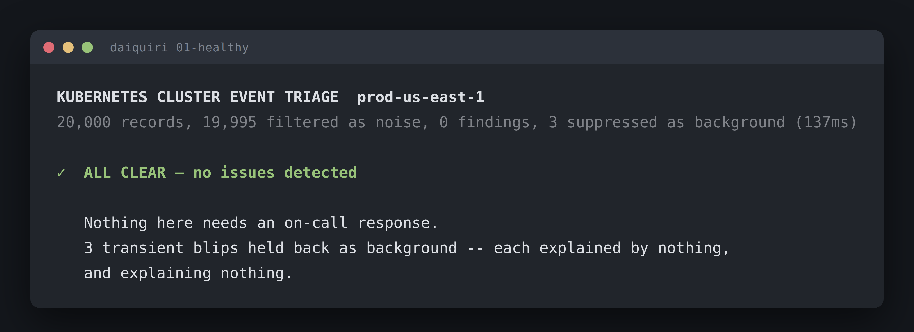

# 01-healthy: nothing here needs an on-call response

Run it yourself:

```sh
go run ./cmd/triage testdata/01-healthy.jsonl
```



Raw output: [`01-healthy.txt`](01-healthy.txt) · [`01-healthy.json`](01-healthy.json)

## What's here

20,000 records. 19,995 are lifecycle noise. The remaining 5 records form three
findings, and all three are background.

```
20,000 records, 19,995 filtered as noise, 0 findings, 3 suppressed as background (139ms)

✓  ALL CLEAR — no issues detected
```

This is the hardest capture in the set, and the one I spent longest on. Getting
to zero is easy if you just raise the bar until nothing clears it. Getting to
zero while still catching every real problem in the other five is the actual
test.

## What the three background findings are

None of them is a parse error or a misclassification. All three are genuine
Kubernetes `Warning` events that the taxonomy correctly calls issues:

| Workload | Namespace | Reason | Rule | n | pods | span |
|---|---|---|---|---|---|---|
| `data-pipeline` | `data` | Evicted | `evicted/memory-pressure` | 1 | 1 | 0s |
| `recommendation-service` | `production` | FailedMount | `failed-mount` | 1 | 1 | 0s |
| `notification-service` | `staging` | Unhealthy | `unhealthy/readiness` | 3 | 1 | 12.5s |

The first one has a real, specific body:

```
The node was low on resource: memory. Container pipeline was using 612Mi,
which exceeds its request of 256Mi.
```

That is a true statement about a real eviction. A pod died. In a cluster of this
size, on a Tuesday, that's Tuesday.

## How to identify it as background

**1. Nothing explains them and they explain nothing.** This is the clause that
does the work. Each of the three is a root (no parent found by any causal rule)
*and* a leaf (no finding below it). They sit alone in the forest.

Compare against `05-test-b`, which has an eviction with the same count, the same
pod count and the same zero-second span, and is part of the incident. The
difference is that its parent is a node condition and it names it in its own
body. Shape alone cannot separate those two. Position can.

**2. They're small on every axis at once.** `count ≤ 10`, `pods ≤ 1`,
`span < 60s`, all three holding. The `notification-service` probe fires 3 times
across 12.5 seconds and stops. A real readiness failure doesn't stop.

**3. They ended long before the capture did.** All three land in the first 14
minutes of a 30-minute window. Nothing is still happening at the end.

**4. They're disclosed and counted.** The header says `3 suppressed as
background`, so a quiet run still tells you how much it held back. Go read
them:

```sh
go run ./cmd/triage -json testdata/01-healthy.jsonl \
  | jq '.findings[] | select(.diagnosis.suppressed) | {identity, shape, diagnosis}'
```

Every clause that decided it is published separately, so you can check which one
fired:

```json
"because": {
  "is_a_recognised_failure": true,
  "is_small_on_every_axis":  true,
  "nothing_explains_it":     true,
  "it_explains_nothing":     true
}
```

## Against the brief's stated answer

> *"Healthy cluster baseline. No real failure (though a few unrelated transient
> warnings exist). Your tool should output 'no issues detected' and exit 0."*

| Required | What the tool does |
|---|---|
| output "no issues detected" | prints `✓ ALL CLEAR — no issues detected` |
| exit 0 | `echo $?` → `0` |
| the transient warnings are unrelated | all 3 are roots with no children, which is the clause that suppresses them |

The brief's own phrasing does some work here. It says the warnings *exist*, so
holding them back and saying so is the correct behaviour, and pretending the
capture was empty is not. `3 suppressed as background` in the header is that
distinction.

## What to do

Nothing. That's the answer, and the tool exits `0`.

If you want to be thorough about it, the `data-pipeline` eviction is worth a
glance at some point during working hours. Its body says the container was using
612Mi against a request of 256Mi, so the request is set below what the service
actually uses. That's config drift. It'll bite eventually on a busier node,
and it isn't why anyone is awake right now.

```sh
kubectl get deploy data-pipeline -n data -o jsonpath='{..resources.requests}'
```

## Confidence: high

The suppression predicate holds back exactly 3 findings in every one of the six
captures, and it's always the same three shapes. That's the corroboration I
trust most. A rule tuned to make this one file come out clean wouldn't land on
the same three in the other five.

The failure mode I care about here is the expensive one: staying quiet on a real
problem. Three things guard it. An unrecognised reason is never suppressed, so
anything outside the taxonomy surfaces. Suppression needs all four clauses, so a
finding with a parent or a child is kept whatever its size. And the count is
printed in the header, so a quiet run still tells you how much quiet it's
responsible for.
