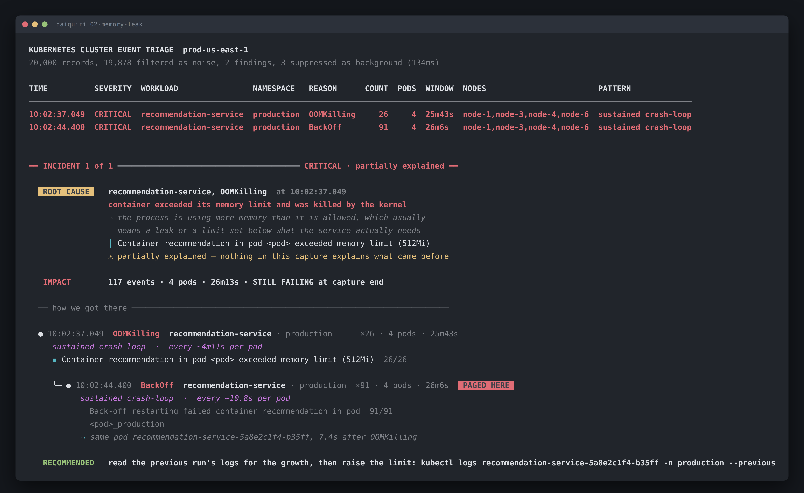

# 02-memory-leak: recommendation-service is being OOM-killed on a loop

Run it yourself:

```sh
go run ./cmd/triage testdata/02-memory-leak.jsonl
```



Raw output: [`02-memory-leak.txt`](02-memory-leak.txt) · [`02-memory-leak.json`](02-memory-leak.json)

## What's broken

`recommendation-service` in `production` exceeds its 512Mi memory limit and the
kernel kills it. The kubelet restarts it, it fills up again, and it gets killed
again. 26 OOM kills and 91 restarts across 4 pods over 26 minutes, still going
when the capture ends.

Every pod is on a different node (`node-1`, `node-3`, `node-4`, `node-6`), which
rules out the node.

## How to identify it

**1. The body names the limit.** No inference:

```
▪ Container recommendation in pod <pod> exceeded memory limit (512Mi)  26/26
```

26 of 26 records say the same thing. `512Mi` survives normalisation because
numbers with units are the answer, and this one tells you the limit is real and
the process walks through it.

**2. Two findings, one problem.** `OOMKilling` and `BackOff` are separate
findings under the same key, and the causal edge joins them:

```
⤷ same pod recommendation-service-5a8e2c1f4-b35ff, 7.4s after OOMKilling
```

The `BackOff` body says `Back-off restarting failed container` and never
mentions memory. That edge is identity plus adjacency, which is the weakest of
the three rules, and the tool says so in the confidence line rather than
pretending otherwise.

**3. The rhythm is the diagnosis.**

```
sustained crash-loop  ·  every ~4m11s per pod
```

One kill per pod every four minutes says more than "26 events over 26 minutes"
ever could. A container that dies on a clock is filling up at a steady rate, and
that's a leak or an undersized limit. A container that dies once and recovers is
a bad request.

Note the *per pod*. There are 4 pods, so finding-wide the kills look about a
minute apart, which is an artefact of the replica count. The 4m11s is the fact
about the workload.

**4. Four pods on four nodes.** If this were node memory pressure you'd see
`Evicted` and a node condition. You see neither. The cgroup limit is what's
killing it, and the cgroup limit travels with the pod.

## What the tool won't tell you, and why

The tool reports the trend as **steady**, and I want to be explicit about that
because I got it wrong first.

I originally called this leak *accelerating*. My evidence was one interval
contracting from 4m41s to 4m12s. That's 2 intervals on 1 pod. Measured across
all 22 intervals in the finding, the early-to-late ratio is 0.79, on samples
already ranging from 169s to 326s. A 21% move on that spread supports nothing,
so the threshold for naming a trend is a 3× move and this doesn't clear it.

Both means are in the JSON. Judge it yourself:

```sh
go run ./cmd/triage -json testdata/02-memory-leak.jsonl \
  | jq '.findings[] | select(.identity.reason=="OOMKilling") | .cadence'
```

The distinction matters operationally. A steady 4-minute cycle is stable, so
raising the limit buys you real time. An accelerating one means the limit only
moves the wall.

## Against the brief's stated answer

> *"One service is repeatedly OOMKilling due to a memory leak. Your tool should
> identify the service, the OOM signature, and the sustained crash-loop
> pattern."*

| Required | What the tool prints |
|---|---|
| identify the service | `recommendation-service · production`, 4 pods |
| the OOM signature | `Container recommendation in pod <pod> exceeded memory limit (512Mi)  26/26` |
| the sustained crash-loop pattern | `sustained crash-loop` in the `PATTERN` column, on both findings |

All three land. One place where I'd push back on the brief's own wording: it
says *"due to a memory leak"*, and the event stream can't establish that. It
proves a limit was exceeded 26 times on a 4-minute clock. A leak and a limit set
below the real working set produce the same events. I know it's a leak because
the brief told me, and the tool says the honest version instead of the one it
was told.

## What to do

Next 5 minutes, get the evidence before the pod that holds it dies again:

```sh
kubectl logs recommendation-service-5a8e2c1f4-b35ff -n production --previous
kubectl top pod -n production -l app=recommendation-service
```

The `--previous` matters. The current container is a fresh one that hasn't filled
up yet, so its logs won't show you the growth.

Then decide between the two real options:

```sh
kubectl get deploy recommendation-service -n production -o jsonpath='{..resources}'
```

Raise the limit if 512Mi was always too small for the working set. Fix the leak
if usage climbs monotonically with no plateau. Raising the limit on an actual
leak buys you a longer interval between the same kills, and the cadence in the
next capture will tell you which one you did.

## Confidence: high on the mechanism, medium on the cause

**High** that the container is exceeding 512Mi and the kernel is killing it. The
cluster states it 26 times and names the number.

**Medium** on whether it's a leak. The event stream can prove a limit was
exceeded. It can't show you an allocation curve, so "leak" versus "limit set too
low" is a distinction this data can't make. Container memory metrics over the
26 minutes would settle it in one graph.

The tool reports this incident as **partially explained**, which is the honest
answer. The proximate cause is found (`OOMKilling`) and nothing in the capture
explains what came before it. No rollout precedes it, no node condition, no
config change. Whatever started this happened before 10:02:37 or outside the
event stream entirely.
