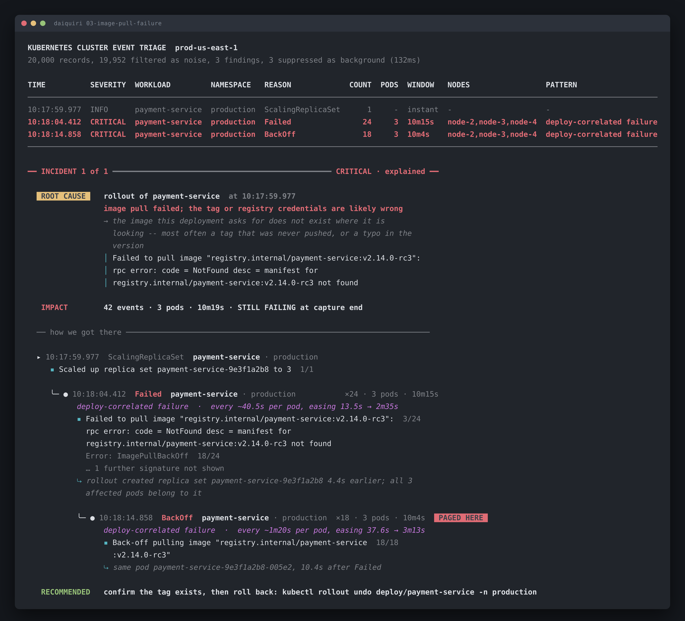

# 03-image-pull-failure: payment-service was rolled out with a tag that doesn't exist

Run it yourself:

```sh
go run ./cmd/triage testdata/03-image-pull-failure.jsonl
```



Raw output: [`03-image-pull-failure.txt`](03-image-pull-failure.txt) · [`03-image-pull-failure.json`](03-image-pull-failure.json)

## What's broken

A rollout of `payment-service` at 10:17:59.977 asks for
`registry.internal/payment-service:v2.14.0-rc3`. That tag was never pushed. All
3 pods of the new replica set fail to pull, the kubelet backs off and retries,
and it's still retrying 10m19s later when the capture ends.

The registry answers, and what it answers is `manifest not found`. So the
credentials are fine and the registry is up. The tag is the problem.

## How to identify it

**1. One line names the whole thing.** The registry's own error:

```
▪ Failed to pull image "registry.internal/payment-service:v2.14.0-rc3":  3/24
  rpc error: code = NotFound desc = manifest for
  registry.internal/payment-service:v2.14.0-rc3 not found
```

`NotFound` on the manifest, with the tag spelled out. `rc3` in a production
rollout is its own tell.

**2. That line is not the most common one.** This is the bit I care about most
in this capture. The most frequent body is `Error: ImagePullBackOff` at 18 of
24, and it tells you nothing you didn't already know from the reason. The line
that names the tag occurs **3 times out of 24** and leads anyway, because
signatures rank by specificity before frequency.

Sort by count and the diagnosis is buried under its own consequence, three
lines down.

**3. Three deep, and the depth is the argument.**

```
▸ ScalingReplicaSet  payment-service        "Scaled up replica set payment-service-9e3f1a2b8 to 3"
   ╰─ ● Failed   ×24                        the manifest doesn't exist
       ╰─ ● BackOff  ×18   PAGED HERE       "Back-off pulling image ..."
```

The rollout is the root, the pull failure is the mechanism, and the back-off is
what would have paged you. Each edge is quoted. The deploy edge is provable
because the rollout body names replica set `payment-service-9e3f1a2b8` and all
3 failing pods carry that prefix:

```
⤷ rollout created replica set payment-service-9e3f1a2b8 4.4s earlier; all 3
  affected pods belong to it
```

**4. The cadence tells you it's giving up slowly.**

```
deploy-correlated failure  ·  every ~40.5s per pod, easing 13.5s → 2m35s
```

`easing` is Kubernetes' exponential back-off. The retries started 13.5 seconds
apart and are now 2m35s apart. This will keep widening whatever you do, and it
will never fix itself, because no amount of retrying conjures a tag.

Compare `06-test-c`, where `FailedScheduling` retries flat at ~20.4s forever.
Flat means the controller isn't backing off. Easing means it is. Neither is
self-resolving, but they behave differently while you're watching, and a flat
line that suddenly goes flat-and-quiet means something changed.

**5. Read which `Failed` this is.** `Failed` covers image pull, sandbox
creation, and other container start failures. The distinction lives entirely in
the body, so the taxonomy reads the body rather than the reason. Same for
`BackOff`, which is crash-loop at `Warning` severity and image-pull retry at
`Normal`. Both are critical, and neither is noise, but they point at completely
different problems.

## Against the brief's stated answer

> *"A deployment references a missing image tag, and new pods cannot pull. Your
> tool should identify the affected service and the `ImagePullBackOff`
> pattern."*

| Required | What the tool prints |
|---|---|
| identify the affected service | `payment-service · production`, 3 pods on 3 nodes |
| the `ImagePullBackOff` pattern | classified as `deploy-correlated failure` with cause *"image pull failed; the tag or registry credentials are likely wrong"* |
| distinguish image-pull `Failed` from other `Failed` | done by reading the body, per the brief's own note |

One deliberate difference. The brief calls the pattern `ImagePullBackOff`, and
the tool's `PATTERN` column says `deploy-correlated failure`. That column names
the *shape* of the failure across time, from the brief's own vocabulary
(sustained crash-loop, transient blip, deploy-correlated failure, capacity
issue, node issue). What kind of failure it is lives one line down in the cause,
and the exact `ImagePullBackOff` string is in the signature list where it came
from.

I'd rather keep those two axes apart. `ImagePullBackOff` answers *what broke*.
`deploy-correlated` answers *what set it off*, which is the thing that tells you
to reach for `rollout undo`.

## What to do

Next 5 minutes:

```sh
kubectl rollout undo deploy/payment-service -n production
kubectl get pods -n production -l app=payment-service   # should go Running
```

Then confirm what actually exists before rolling forward:

```sh
crane ls registry.internal/payment-service | grep v2.14
kubectl get deploy payment-service -n production -o jsonpath='{..image}'
```

Don't go pulling application logs. There are none. The container never started,
so there's nothing inside it to have logged anything.

## Confidence: high

The registry states the reason itself, the tag is quoted in full, and the
rollout that introduced it is 4.4 seconds before the first failure with zero
occurrences before it. Not much room for a different reading.

What would raise it further: the previous revision's image reference. I'm
inferring that `v2.14.0-rc3` replaced something that worked, and
`kubectl rollout history deploy/payment-service -n production --revision=<n>`
would confirm it. It doesn't change the fix.
