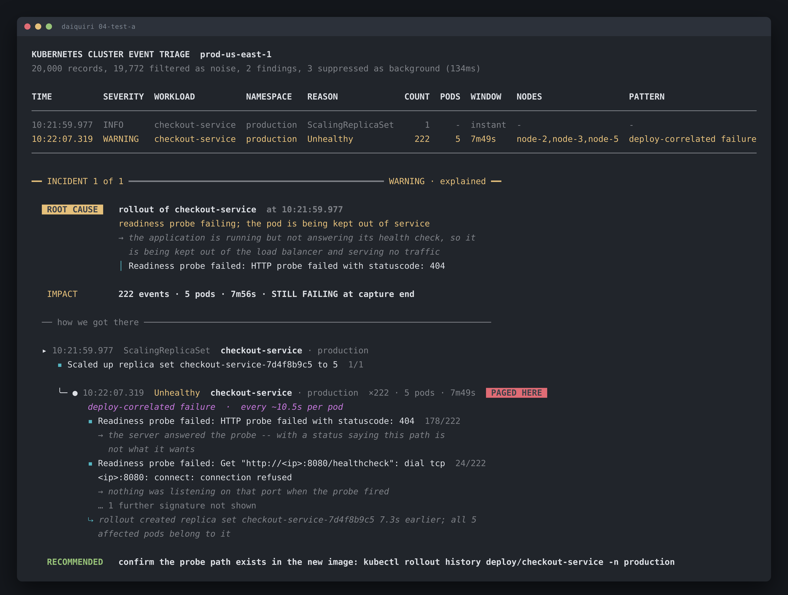

# 04-test-a: checkout-service is down after a bad rollout

Run it yourself:

```sh
go run ./cmd/triage testdata/04-test-a.jsonl
```



Raw output: [`04-test-a.txt`](04-test-a.txt) · [`04-test-a.json`](04-test-a.json)

## What's broken

The `checkout-service` rollout at 10:21:59.977 shipped a build whose readiness
path returns 404. All 5 replicas of the new replica set fail readiness, none has
ever passed, and it's still going when the capture ends 7m49s later.

So the Service has zero ready endpoints. `checkout-service` in `production`
isn't degraded, it's serving nothing.

## How to identify it

Three things in the output, in the order they matter.

**1. The 404.** This is the whole diagnosis:

```
▪ Readiness probe failed: HTTP probe failed with statuscode: 404   178/222
  → the server answered the probe -- with a status saying this path is not what it wants
```

A 404 means the container is up and routing. It's answering you, and what it's
answering is that the path doesn't exist. So the image pulled fine and the
process runs. Somebody moved or removed the health endpoint.

Compare that with `connection refused`, which would mean nothing was listening
at all. Same `Unhealthy` reason, completely different problem.

**2. The timing.** First failure lands 7.3 seconds after the rollout, with zero
occurrences before it:

```
⤷ rollout created replica set checkout-service-7d4f8b9c5 7.3s earlier;
  all 5 affected pods belong to it
```

Zero before, 222 after, every affected pod belonging to the new replica set.
That's about as clean as deploy correlation gets.

**3. The scope.** `5 pods` in the table, against a rollout that says `to 5`.
Every replica is affected, which is what turns this from a warning into an
outage. The tool prints `WARNING`, because that's the severity Kubernetes
assigns an `Unhealthy` event. The severity is per event type. The scope is per
incident. Read both.

## What to do

Next 5 minutes:

```sh
kubectl rollout undo deployment/checkout-service -n production
kubectl get endpoints checkout-service -n production   # should stop being empty
```

Then, before you roll forward again, diff the probe path in the deployment spec
against the routes the new build actually serves. `kubectl rollout history
deploy/checkout-service -n production` gives you the revision to compare.

Don't bother reading application logs for a crash. There isn't one. The process
is healthy and the deployment's idea of "healthy" is stale.

## Confidence: high

High on the rollout as cause and the 404 as mechanism. The evidence is direct,
not inferred.

Two things would raise it further.

**44 of the 222 events aren't 404s.** 24 are `connection refused`, 20 are
timeouts, and the event stream doesn't explain them. All 5 pods `Started`
between 10:22:02 and 10:22:24 and were never killed, so these aren't restart
churn. I'd want container logs to see whether the process is flapping internally
without the kubelet noticing.

**The previous revision's probe path.** I'm inferring the endpoint moved. The
old spec would confirm it.
