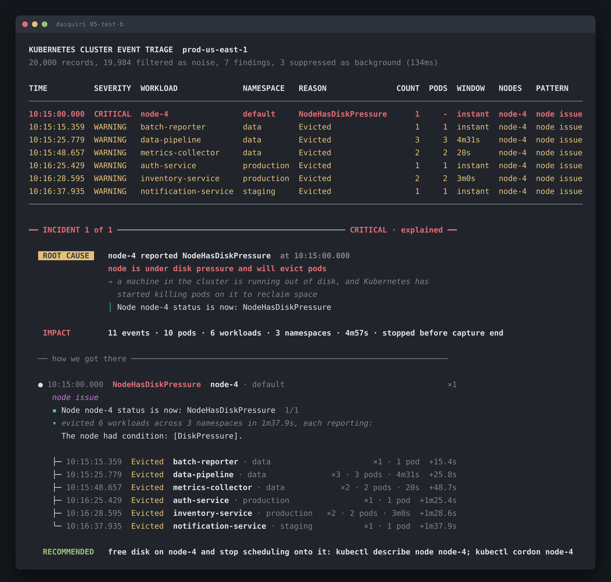
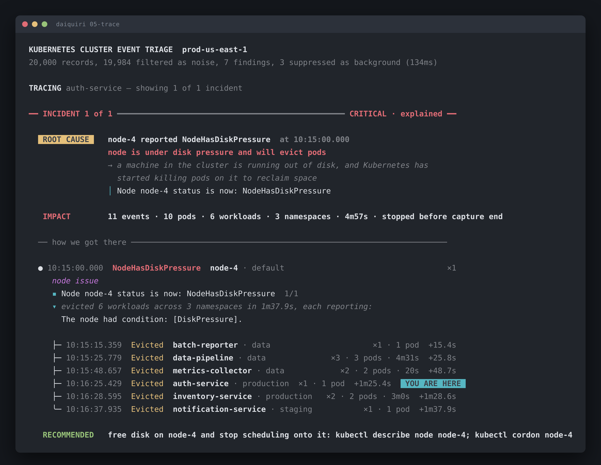

# 05-test-b: node-4 filled its disk and evicted six unrelated services

Run it yourself:

```sh
go run ./cmd/triage testdata/05-test-b.jsonl
go run ./cmd/triage --trace auth-service testdata/05-test-b.jsonl
```



Traced to one workload with `--trace auth-service`:



Raw output: [`05-test-b.txt`](05-test-b.txt) · [`05-test-b.json`](05-test-b.json)

## What's broken

`node-4` reported `NodeHasDiskPressure` at 10:15:00.000. Its kubelet then
evicted 10 pods across 6 workloads in 3 namespaces, all within 1m38s.

One node. Six services that have nothing to do with each other. None of them did
anything wrong, and none of them needs a code change.

The incident stopped 10 minutes before the capture ends, so the node either
recovered or somebody drained it.

## How to identify it

This is the one that looks like six separate incidents in a flat report. Here's
what tells you it's one.

**1. Every evicted pod names the condition.** You don't have to infer the link,
the records state it:

```
● 10:15:00.000  NodeHasDiskPressure  node-4 · default
  ▪ Node node-4 status is now: NodeHasDiskPressure
  ▾ evicted 6 workloads across 3 namespaces in 1m37.9s, each reporting:
    The node had condition: [DiskPressure].
```

The node says `NodeHasDiskPressure`. Every eviction body says
`The node had condition: [DiskPressure]`. Same node, +15.4s to +1m37.9s later.

**2. The blast radius crosses namespaces.** `data`, `production` and `staging`
all lose pods inside 98 seconds. Application faults don't do that. Anything
hitting three namespaces at once is infrastructure, and the shared dimension is
almost always a node.

**3. The control case.** This capture also has a `data-pipeline` eviction at
10:02:32 whose body reads `The node was low on resource: memory`, on **node-2**,
13 minutes earlier. Different node, different cause. The tool keeps it separate
and suppresses it as background.

That one matters. If you group evictions by workload and reason alone, it merges
into the node-4 incident and drags the start time 13 minutes before the event
that caused it. Then the causal link fails, because effects can't precede
causes. Check the body, not just the reason.

## What to do

Next 5 minutes:

```sh
kubectl cordon node-4                 # stop scheduling more onto it
kubectl describe node node-4          # confirm DiskPressure, check conditions
```

Then find what ate the disk. Image cache and container logs first, they're the
usual culprits:

```sh
crictl imagefsinfo
du -sh /var/log/pods/* | sort -h | tail
```

Uncordon once you've reclaimed space. The evicted pods reschedule on their own,
so don't go restarting six deployments by hand.

If you own one of the six services and got paged for it, `--trace <your-service>`
shows you the trail without the other five.

## Confidence: high on the what, low on the why

**High** that disk pressure on node-4 evicted these pods. The cluster states it
in both directions and the timing is tight.

**Low** on what filled the disk. That's not in an event stream at all, it's a
node metric. `crictl imagefsinfo`, or whatever you have for node disk usage
over time, would answer it.

Also unresolved: whether the node recovered. The silence after 10:16:37 reads
the same whether it healed or somebody drained it and walked away.
