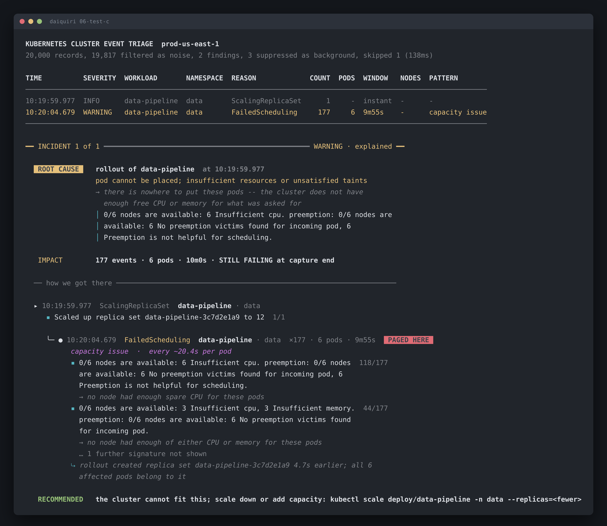

# 06-test-c: data-pipeline was scaled past what the cluster can fit

Run it yourself:

```sh
go run ./cmd/triage testdata/06-test-c.jsonl
```



Raw output: [`06-test-c.txt`](06-test-c.txt) · [`06-test-c.json`](06-test-c.json)

## What's broken

`data-pipeline` was scaled to 12 replicas at 10:19:59.977 and the cluster can't
place them. At least 6 pods are stuck `Pending`, with 177 scheduling failures
over 9m55s, still failing when the capture ends.

Nothing is crash-looping. No pod that did start has failed. This is a capacity
problem, and the fix is arithmetic rather than debugging.

## How to identify it

**1. The scheduler tells you outright.** No inference needed:

```
▪ 0/6 nodes are available: 6 Insufficient cpu.                        118/177
  → no node had enough spare CPU for these pods
▪ 0/6 nodes are available: 3 Insufficient cpu, 3 Insufficient memory.  44/177
  → no node had enough of either CPU or memory for these pods
```

`0/6 nodes are available` means every node in the cluster was evaluated and
rejected. That's the whole search space, not a scheduling hiccup.

**2. Read which resource binds.** CPU is the constraint on all 6 nodes in the
common case. On 3 of them memory binds too. So adding CPU alone won't place
every pod, and you'd find that out the slow way after the next scale-up.

**3. The cadence is flat.**

```
capacity issue  ·  every ~20.4s per pod
```

20 seconds is the scheduler's retry interval. It'll keep doing this forever.
Compare with 03, where the interval eases from 13s to 2m35s because Kubernetes
backs off image pulls. A flat retry means nothing is self-resolving and nothing
will.

**4. Look for what isn't there.** No `BackOff`, no `OOMKilling`, no `Unhealthy`.
Pods that scheduled are fine. Only the ones that couldn't be placed are
complaining, which points at the cluster rather than the workload.

## What to do

Next 5 minutes, get back to a size the cluster held:

```sh
kubectl scale deployment/data-pipeline -n data --replicas=<previous>
kubectl get pods -n data --field-selector=status.phase=Pending   # should empty out
```

Then decide properly, because you've got two real options and they cost
different things:

```sh
kubectl describe node | grep -A5 'Allocated resources'   # how much headroom exists
kubectl get deploy data-pipeline -n data -o yaml | grep -A4 resources
```

Either add nodes, or lower the pods' CPU requests if they're over-asking. Check
actual usage before you cut requests, or you'll trade Pending pods for throttled
ones.

## Confidence: high

The scheduler states its own reason and names how many nodes it rejected. Not
much room for a different reading.

What would raise it: the deployment's resource requests next to the nodes'
allocatable capacity. That turns "insufficient" into an exact shortfall, which
is the number you need to size the fix.

## One data-quality note

This capture has 1 malformed line the tool couldn't parse, disclosed in the
header as `skipped 1`. It's the last line of the file.

20,000 records read fine and the diagnosis doesn't depend on the missing one.
Worth saying anyway, because a capture the tool couldn't fully read should never
be presented as a clean one.
